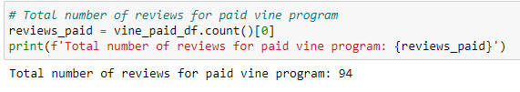
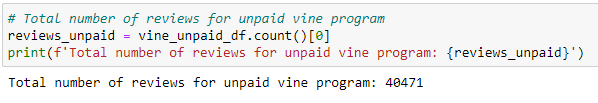
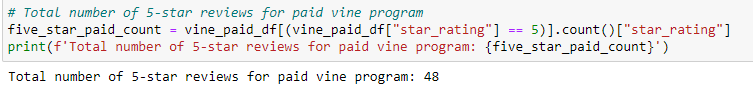
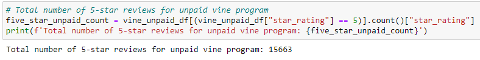
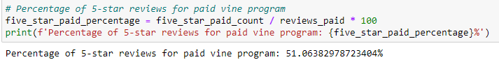
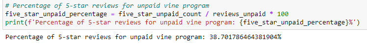

# Amazon Vine Analysis
**ETL File:** \
**Analysis File:** 
## Purpose
Jennifer needs our help with a new project. Our goal is to analyze Amazon reviews that were written by paid members of the Amazon Vine program. First, we pick a specific type of product to do our review on. The type of product I chose was video games. We will utilize PySpark to extract the data set, transform the data, connect with a AWS RDS instance, then load the newly transformed data into pgAdmin by performing the ETL process. Next, I used Pandas to analyze the data in order to see if there is any bias regarding complimentary reviews from paid members of the Amazon Vine program in the dataset.
## Results
- **How many Vine reviews and non-Vine reviews were there?**
  - There are 94 total Vine reviews.\

  - There are 40,471 total non-Vine reviews.\

- **How many Vine reviews were 5 stars? How many non-Vine reviews were 5 stars?**
  - There are 48 5-star Vine reviews.\

  - There are 15,663 5-star non-Vine reviews.\

- **What percentage of Vine reviews were 5 stars? What percentage of non-Vine reviews were 5 stars?**
  - 51.06% of the Vine reviews are 5-star reviews.\

  - 30.70% of the non-Vine reviews are 5-star reviews.\

## Summary
We can see there is positivity bias from the percentages of 5-star reviews of Vine reviews. The percentage of 5-star Vine reviews is 51.06% whereas the percentage of non-Vine reviews is 30.70%. However, there were only 94 total Vine reviews. Non-Vine members had 40,471 reviews. The sample sizes of each are significantly different from each other. Therefore, we can't say for sure there is positivity bias. We might be able to conclude there is positivity bias if we had a larger sample size of Vine members. Another analysis I would do with the dataset is to show the distribution of the data. I would create a histogram showing the distribution of star reviews. 
